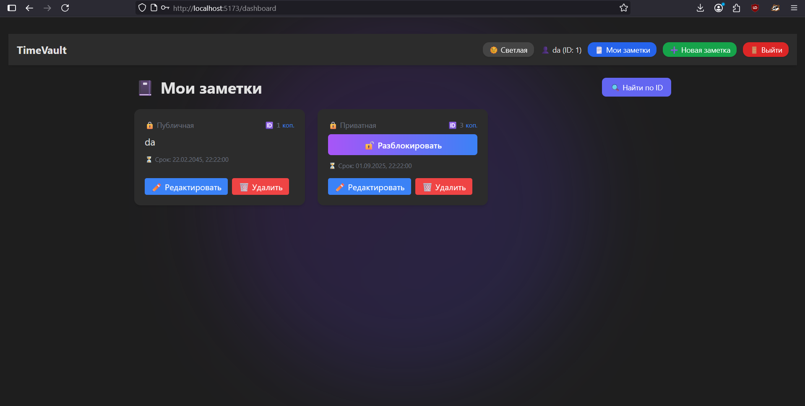
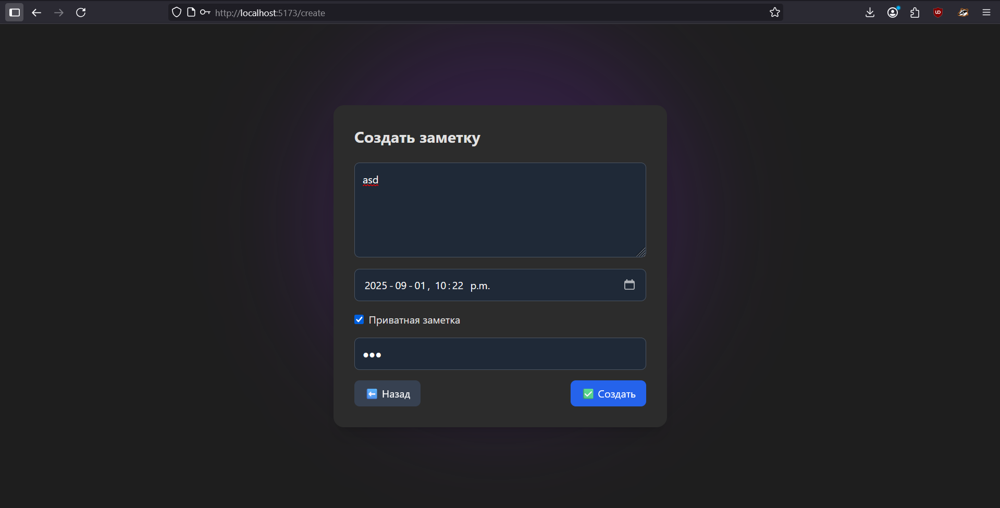

# private-notes

## Описание

**private-notes** — это веб-приложение для создания и хранения заметок с функцией публичности/приватности, аутентификацией пользователей через JWT‑токены и хранением данных в PostgreSQL.  
Бэкенд написан на Go, фронтенд — на React.


## Возможности

- Регистрация и вход пользователей
- Аутентификация через JWT-токены, refresh-токены
- CRUD для заметок (создание, просмотр, редактирование, удаление)
- Публичные и приватные заметки (приватные можно защитить паролем)
- Автоматическая очистка просроченных заметок и refresh-токенов
- Докеризация всех компонентов (backend, frontend, postgres)


## Структура проекта

- **backend/** — сервер Go, основные функции, модели, маршруты и middleware
- **frontend/** — клиентская часть на React/Vite
- **init.sql** — SQL-скрипт для инициализации БД
- **docker-compose.yml** — запускает все сервисы и настраивает volume для постгреса
- **.env** — все переменные (DB, JWT и пр.)
*

## Быстрый старт

1. **Заполни .env для базы и JWT (пример внутри проекта):**
    ```
    POSTGRES_HOST=postgres
    POSTGRES_PORT=5432
    POSTGRES_USER=postgres
    POSTGRES_PASSWORD=postgres
    POSTGRES_DB=private_notes
    JWT_SECRET=yourSecretKey
    ```

2. **Запусти проект через Docker Compose:**
    ```sh
    docker-compose up --build
    ```

    Будет поднято три сервиса:
    - backend (порт 2288)
    - frontend (порт 5173)
    - postgres (порт 5432, с volume и init.sql)

3. **Открой фронтенд на (http://localhost:5173) — через браузер.**


## Документация API

- `POST /register` — регистрация
- `POST /login` — вход, получение токена
- `POST /refresh-token` — обновление access/refresh токенов
- `POST /logout` — выход
- `GET /me` — ваши заметки
- CRUD-ручки для работы с заметками (`/notes`, `/notes/{id}`, `/notes/public/{id}`, ...)
- Все запросы с авторизацией требуют заголовок `Authorization: Bearer `

## JWT авторизация

В файле `internal/api/authorization.go` реализованы функции генерации и проверки access-token/refresh-token, а также защита (middleware) эндпоинтов.

- Для access — используется короткоживущий JWT
- Для refresh — UUID + срок действия 7 дней, хранится в отдельной таблице

## Скриншоты

_Чтобы добавить скриншоты интерфейса, просто помести их в папку проекта (например, `screenshots/`) и вставь так:_

```


```


## Сборка и запуск без Docker

1. Подними Postgres, выполни init.sql вручную
2. Собери backend:  
    ```sh
    go run ./cmd/main.go
    ```
3. Собери frontend:  
    ```sh
    cd frontend
    npm install
    npm run dev
    ```


## Заметки

- Все данные Postgres лежат в Docker volume начиная с первого запуска.  
- Миграция schemas — через init.sql.
- Логика и структура легко расширяются под свои задачи.


**_Добавь свои скриншоты, демо и инструкции в этот README — и проект готов для публикации или командной работы!_**